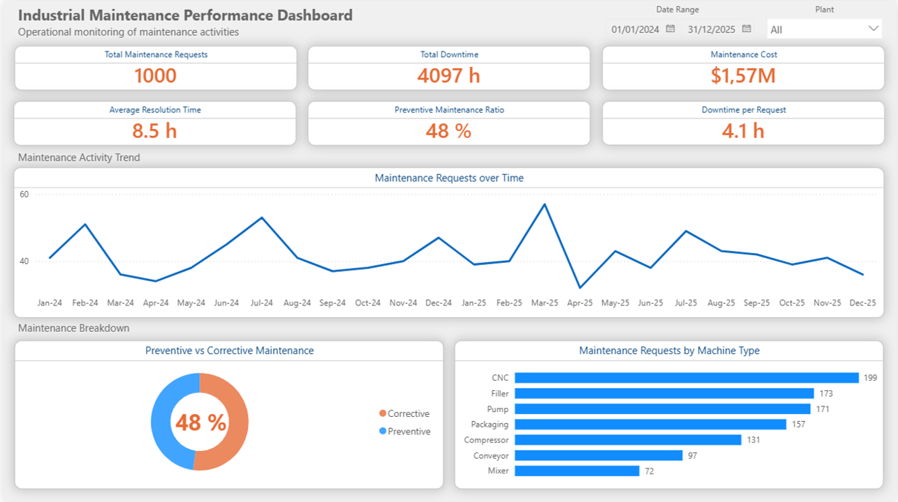
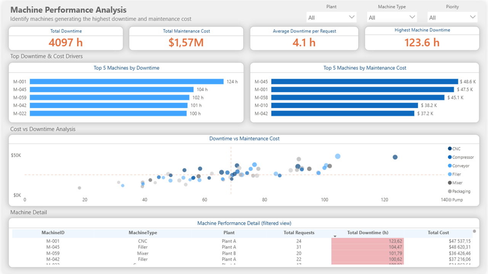
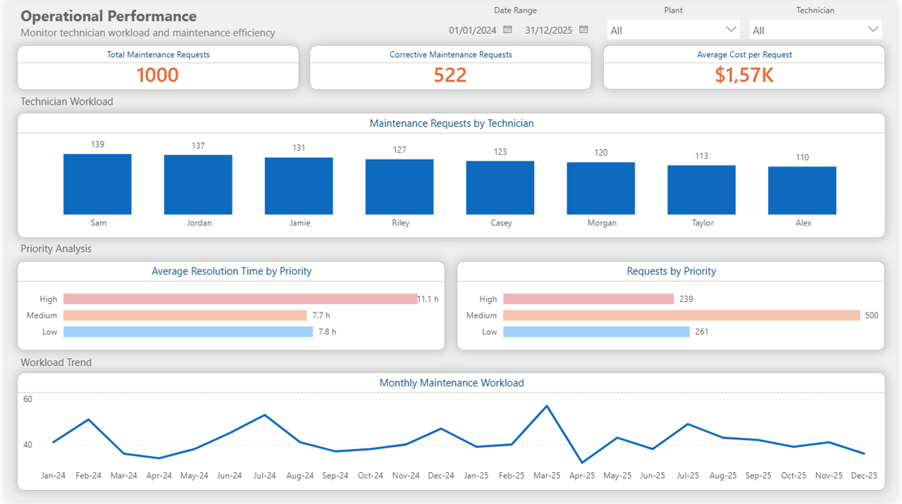
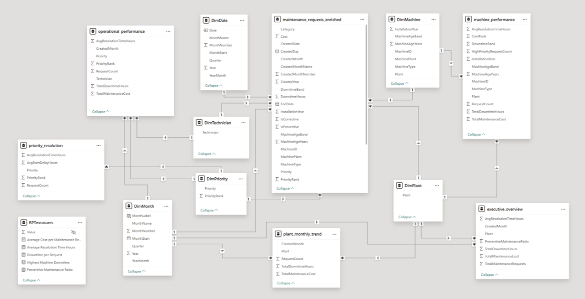

# Industrial Maintenance Analytics Dashboard

Industrial maintenance reporting workflow built with Python, SQL Server, and Power BI to monitor downtime, maintenance cost, machine performance, and execution efficiency.

## Project Overview

This project simulates an industrial maintenance environment and transforms raw operational data into a structured reporting workflow for monitoring downtime, maintenance cost, request volume, machine performance, and technician-level execution patterns.

The solution is built across Python, SQL Server, and Power BI. Python generates the source data, SQL Server creates the transformation and reporting layer, and Power BI delivers the final semantic model and interactive dashboard experience.

The goal is to support both executive monitoring and operational investigation through a cleaner end-to-end BI workflow than a dashboard built directly on flat files.

## Business Objective

The dashboard is designed to answer three operational questions:

1. How much maintenance activity, downtime, and cost is the organization absorbing over time?
2. Which machines are driving the largest operational and financial impact?
3. How do maintenance execution patterns vary by technician, priority, and maintenance type?

The reporting flow is structured to support both high-level decision-making and day-to-day performance analysis.

## End-To-End Pipeline

### 1. Python - Source Data Generation

Python is used to simulate the source entities of the maintenance environment, including machines and maintenance requests.

### 2. SQL Server - Transformation And Reporting Layer

SQL Server handles the analytical transformation layer by joining source tables, deriving operational metrics, and exposing reporting-ready views aligned to the dashboard pages.

### 3. Power BI - Semantic Model And Dashboarding

Power BI consumes the SQL views through shared dimensions and KPI measures to deliver interactive reporting across executive, machine, and operational views.

## Dashboard Pages

### Executive Overview

This page is designed for high-level operational monitoring across maintenance volume, downtime, cost, and preventive maintenance behavior.

Key analyses include total maintenance requests, total downtime hours, total maintenance cost, preventive maintenance ratio, and monthly maintenance trend.



### Machine Performance Analysis

This page is designed for asset-level diagnosis and machine comparison.

Key analyses include top machines by downtime, top machines by maintenance cost, highest machine downtime, and downtime-versus-cost behavior.



### Operational Performance

This page is designed for technician- and priority-level execution analysis.

Key analyses include corrective maintenance requests, average cost per maintenance request, requests by priority, average resolution time by priority, and monthly operational trend.



## Data Model Design

The final Power BI model is built around shared dimensions so that filtering remains consistent across report pages and visuals.



### Shared Dimensions

- DimPlant
- DimMachine
- DimTechnician
- DimPriority
- DimDate
- DimMonth

### Core Analytical View

`maintenance_requests_enriched` is the central detailed view. It joins machines and maintenance requests, derives operational metrics, and creates the request-level fields used throughout the report.

### Reporting Views By Dashboard Page

- `executive_overview` supports executive monitoring by plant and month.
- `machine_performance` supports machine-level ranking and asset comparison.
- `operational_performance` supports technician and monthly operational analysis.
- `priority_resolution` supports priority-level service pattern analysis.
- `plant_monthly_trend` supports plant-level monthly trend analysis.

## Why The SQL Layer Matters

The most important upgrade in this project is the introduction of a dedicated SQL transformation layer between source data generation and dashboarding.

- SQL handles joins, derived business logic, and reporting-ready views.
- Power BI focuses on semantic modeling, KPI measures, and interaction design.
- The overall solution reflects a more realistic BI workflow than a dashboard built directly on flat files.

## Validation Approach

The SQL-backed model was validated through a parallel comparison with the original dashboard.

- visuals were remapped page by page against the legacy version
- KPI values were checked under controlled filter scenarios
- legacy tables were removed only after the new model matched expected behavior

## How To Reproduce

1. Run the Python data-generation step to create the source CSV files
2. Load `machines.csv` and `maintenance_requests.csv` into SQL Server staging tables
3. Run the SQL scripts in order from `01_create_staging_tables.sql` to `05_validation_queries.sql`
4. Open the SQL-backed Power BI file
5. Refresh the model and validate the visuals

## Repository Structure

```text
SQL/
  01_create_staging_tables.sql
  02_load_source_tables.sql
  03_create_core_views.sql
  04_create_reporting_views.sql
  05_validation_queries.sql
dashboard/
  industrial-operations-dashboard-sql.pbix
data/
  generate_industrial_dataset.py
  analysis.py
  machines.csv
  maintenance_requests.csv
images/
  data_model.png
  maintenance_dashboard_overview.png
  machine_performance_analysis.png
  operational_performance.png
```

## Tools Used

- Python
- pandas
- SQL Server
- SQL Server Management Studio
- Power BI

## Key Analytical Skills Demonstrated

- SQL staging and transformation workflow
- analytical view design for BI reporting
- Power BI semantic modeling with shared dimensions
- DAX measures for KPI and ratio logic
- model validation through parallel remapping
- dashboard migration from legacy flat-file logic to SQL-backed reporting views

## Outcome

This project demonstrates how industrial operational data can be generated, transformed, validated, and delivered through a structured BI workflow.

The final deliverable combines Python-based source generation, SQL-based transformation and reporting logic, and Power BI-based semantic modeling into a dashboard built for both executive and operational analysis.

## SQL Scripts Breakdown

<details><summary>See more</summary>

- `01_create_staging_tables.sql` creates the database and staging tables used to receive the source data
- `02_load_source_tables.sql` supports the data load step from the generated CSV files into SQL Server
- `03_create_core_views.sql` builds the enriched request-level analytical view used as the foundation of the reporting layer
- `04_create_reporting_views.sql` creates the page-oriented reporting views consumed by Power BI
- `05_validation_queries.sql` contains validation checks used to reconcile row counts, totals, and view outputs before replacing the legacy model

</details>

## Extended SQL View Details

<details><summary>See more</summary>

- `maintenance_requests_enriched` joins source entities, derives operational metrics, and prepares request-level business logic
- `executive_overview` aggregates maintenance activity by plant and month for high-level monitoring
- `machine_performance` aggregates machine-level performance metrics for ranking and comparison
- `operational_performance` supports technician and monthly execution analysis
- `priority_resolution` isolates priority-level service patterns
- `plant_monthly_trend` supports plant-level monthly trend analysis

</details>
